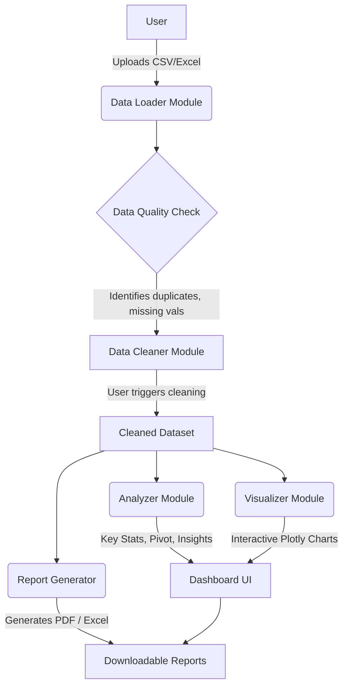

# 📊 Excel Automation & Data Analytics Tool


A complete, production-quality web application designed to empower users to easily upload, clean, analyze, visualize, and generate reports from raw Excel or CSV datasets without writing a single line of code.

🚀 **Live Application:** [**https://smart-excel-tools.streamlit.app/**](https://smart-excel-tools.streamlit.app/)

---

## ✨ Features

- 📁 **Seamless Uploads:** Drag and drop support for `.csv`, `.xls`, and `.xlsx` files.
- 🧹 **Automated Data Cleaning:** 
  - One-click removal of duplicate rows.
  - Intelligent filling of missing numeric values (Mean/Median) and categorical values (Mode).
  - Trims unnecessary whitespace from text data.
- 📈 **Dynamic Visualizations:** Generates fully interactive Plotly charts (Histograms, Bar Charts, Time Series, Heatmaps) tailored automatically to your data types.
- 📊 **Pivot Table Analysis:** User-friendly pivot table generator for custom data aggregations (Sum, Mean, Min, Max, Count).
- 💡 **Automated Insights:** Extracts rule-based smart insights and statistical summaries instantly.
- 📑 **Export & Reporting:** Download the cleaned dataset in CSV format, or generate a **multi-sheet Excel Report** and a **Professional PDF Summary** (powered by ReportLab).
- 🌙 **Modern UI:** Features a sleek dark mode with glassmorphism metric cards, animated backgrounds, and a highly responsive design.

---

## 🏗️ Architecture & Workflow



---

## 🛠️ Project Structure

```text
excel-automation-tool/
├── app.py                      # Main Streamlit application with custom CSS
├── requirements.txt            # Python dependencies
├── README.md                   # Project documentation
├── generate_sample_data.py     # Script to generate synthetic test data
├── modules/                    # Core logic separated into distinct modules
│   ├── __init__.py
│   ├── data_loader.py          # Handles safe file uploads
│   ├── data_cleaner.py         # Handles deduplication and imputation
│   ├── analyzer.py             # Statistical summaries & insights
│   ├── visualizer.py           # Plotly chart generation
│   ├── report_generator.py     # PDF (ReportLab) & Excel (OpenPyXL) building
│   └── utils.py                # UI Helpers
└── sample_data/
    └── sample_sales_data.xlsx  # Ready-to-use sample file
```

---

## 💻 Local Installation & Setup

1. **Clone the repository:**
   ```bash
   git clone https://github.com/manyatagupta/Excel-Automation-Data-Analytics-Tool.git
   cd Excel-Automation-Data-Analytics-Tool
   ```

2. **Install the dependencies:**
   ```bash
   pip install -r requirements.txt
   ```

3. **Run the Streamlit application:**
   ```bash
   streamlit run app.py
   ```

4. **Open in Browser:**
   The application will be running locally at `http://localhost:8501`.

---

## 🚀 Deployment

This application is officially deployed on **Streamlit Community Cloud**. 
You can visit the app and test it using the sample data provided in the repository!

🔗 **[Try it out here!](https://smart-excel-tools.streamlit.app/)**

---

## 🤝 Contributing

We welcome contributions to make the **Excel Automation & Data Analytics Tool** even better! 

If you have a suggestion that would make this better, please fork the repo and create a pull request. You can also simply open an issue with the tag "enhancement".
1. Fork the Project
2. Create your Feature Branch (`git checkout -b feature/AmazingFeature`)
3. Commit your Changes (`git commit -m 'Add some AmazingFeature'`)
4. Push to the Branch (`git push origin feature/AmazingFeature`)
5. Open a Pull Request
